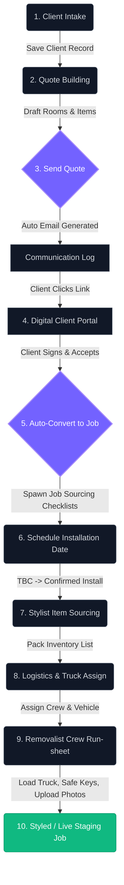

# Sales by Design CRM - Operations Suite & Quick-Start Tutorial

Welcome to the **Sales by Design** Home Staging & Logistics CRM. This suite controls the digital operational workflow of staging jobs from client intake, drafting quotes, client portal signing, inventory sourcing, truck logistics, and removalist crew logs.

---

## 🚀 Quick Start (Local Run)
To start both the frontend Vite server and backend Express API simultaneously, run:
```bash
npm run dev
```
*   **Frontend UI**: `http://localhost:3001/` (or `3000`)
*   **Backend Server**: `http://localhost:5000/`

---

## 📊 Staging Operations Workflow Flowchart

Below is a visual flowchart detailing the lifecycle of a staging quote from initial intake to final live staging delivery:



---

## 🔑 System User Role Mapping

Each team member has a specific access context. Below is the operational matrix showing which roles handle each staging step:

```mermaid
grid
    Admin --> [Intake, Quotes, Sourcing, Logistics Dispatch, Crew Run-sheets]
    Head_Stylist --> [Quotes, Sourcing, Logistics Dispatch]
    Stylist --> [Sourcing Workstation]
    Removalist_Crew --> [Logistics Run-sheets, Key Retrieve, Photo Uploads]
```

---

## 📖 Step-by-Step User Operations Tutorial

Follow this step-by-step guide to run through the entire staging lifecycle from start to finish:

### Step 1: Staff Sign In
1. Open the browser to `http://localhost:3001/`.
2. Scroll to the bottom of the sign-in page to the **Demo Account Quick-Select** panel.
3. Click the red button: **Admin (Sarah)**. This fills in the administrator credentials automatically and logs you into the central dashboard.

### Step 2: Client Intake (Register a Client)
Before quoting a staging proposal, you must register the client in the database:
1. Click **Clients & Agents** in the sidebar.
2. Click the blue **+ Add New** button at the top right.
3. Fill out the client's name (e.g. *John Smith*), email address, phone, and property address.
4. Set the lead source (e.g. *Referred by Agent* or *Word of Mouth*).
5. Click **Save Client**.

### Step 3: Quote Building (Drafting the Agreement)
Compile rooms, furniture layouts, and hire durations for the agreement:
1. Click **Quotes & Builder** in the sidebar.
2. Click the **+ New Quote** button at the top right.
3. Select your newly created client from the **Client * ** dropdown menu.
4. Add rooms you are staging (e.g. *Living Room*, *Master Bedroom*), enter notes, and assign inventory line items.
5. Choose the lease hire duration (e.g. *6 Weeks* or *8 Weeks*).
6. Click **Create Quote**. The quote is successfully recorded as a **Draft**.
7. Locate your quote row, and click the blue **Send Quote** button. This registers the email log and simulates dispatching the signature contract link.

### Step 4: Digital Signing (Client Portal Simulation)
Accept the quote from the client's perspective to promote it to an active Job:
1. Click **Communication Log** in the sidebar.
2. Locate the email log sent to your client and click the **[Magic Link Portal]** button.
3. This opens a new browser view representing the client's signature portal.
4. Review the quote summary, scroll down to the acceptance form, type your name, draw a signature, and click **Accept & Sign Proposal**.
5. *The system automatically flags the quote as Signed and converts it into an active Job in the database, creating the inventory checklists.*

### Step 5: Scheduling Staging Dates
1. Return to the main CRM tab.
2. Click **Jobs Directory** in the sidebar.
3. You will see your new job listed as **Booked** (dates marked as *TBC*).
4. Click the **Date/Schedule** button.
5. Select **Set Installation Date**, choose a date, and click **Save Changes**. The status updates to **Install Scheduled** and de-installation return offsets are automatically computed.

### Step 6: Sourcing Warehouse Inventory (Stylist Flow)
Stylists pick specific stock pieces from the staging catalog:
1. Switch your active role to **Stylist** via the profile drop-down in the header.
2. Click **Sourcing Workstation** in the sidebar.
3. Locate your job and click **Sourcing** (the folder icon).
4. Mark furniture items as **Sourced** or **Out of Stock** based on physical pack availability, then click save.

### Step 7: Logistics Dispatch & Execution (Removalist Flow)
Assign transport resources and complete the staging run-sheet:
1. Switch back to the **Admin** role.
2. Click **Logistics Dispatch** in the sidebar.
3. Assign a **Stylist** and a **Removalist Truck** to the job, and click save.
4. Switch your active role to **Removalist Crew**.
5. Click **Logistics Run-sheet** in the sidebar. Your crew can now view loading lists, confirm key retrieval safety coordinates, upload completion photos, record any asset damage, and mark the job status as **Styled/Live**!
